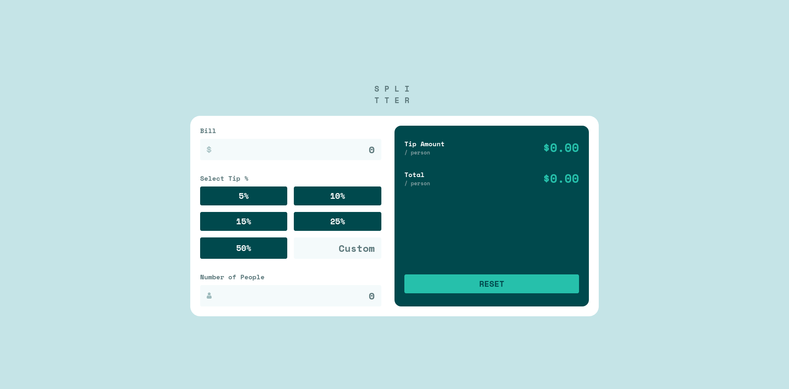

# Frontend Mentor - Tip calculator app solution

This is a solution to the [Tip calculator app challenge on Frontend Mentor](https://www.frontendmentor.io/challenges/tip-calculator-app-ugJNGbJUX). Frontend Mentor challenges help you improve your coding skills by building realistic projects.

## Table of contents

- [Overview](#overview)
  - [The challenge](#the-challenge)
  - [Screenshot](#screenshot)
- [My process](#my-process)
  - [Built with](#built-with)
  - [Continued development](#continued-development)
  - [Useful resources](#useful-resources)
  - [AI Collaboration](#ai-collaboration)
- [Author](#author)
- [Acknowledgments](#acknowledgments)

## Overview

### The challenge

Users should be able to:

- View the optimal layout for the app depending on their device's screen size
- See hover states for all interactive elements on the page
- Calculate the correct tip and total cost of the bill per person

### Screenshot

## My process

### Built with

- Semantic HTML5 markup
- CSS custom properties
- Flexbox
- CSS Grid
- Vanilla JavaScript

### Continued development

I want to keep strengthening my JavaScript fundamentals — especially event handling and keeping UI updates in sync with state. I also want to practice error states and invalid input handling in future projects, since accessibility and clear feedback are things I'm still getting comfortable with.

### Useful resources

- [MDN: `Number.prototype.toFixed()`](https://developer.mozilla.org/en-US/docs/Web/JavaScript/Reference/Global_Objects/Number/toFixed) - Helped me get my currency values displaying correctly.
- [MDN: CSS selectors and combinators](https://developer.mozilla.org/en-US/docs/Web/CSS/CSS_selectors) - Helped me understand the difference between descendant and sibling selectors.

### AI Collaboration

I used an AI assistant (via opencode) as a supportive guide while building this project. Rather than writing code for me, it helped me work through problems:

- Debugging my error message selector (led me to thinking about CSS combinators and specificity)
- Introducing me to `toFixed()` for rounding money values
- Reviewing my approach to the calculator logic

I found it most useful when it asked questions that made me examine my own code, and least useful when I was tempted to ask it for direct answers instead of testing things myself.

## Author

- Website - [yousefosama](https://yousefosama.vercel.app)
- Frontend Mentor - [@iyousefosama](https://www.frontendmentor.io/profile/iyousefosama)

## Acknowledgments

Thanks to the Frontend Mentor community for the ongoing support and to my AI study partner for helping me debug without handing me the answers.